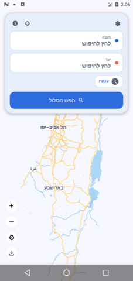
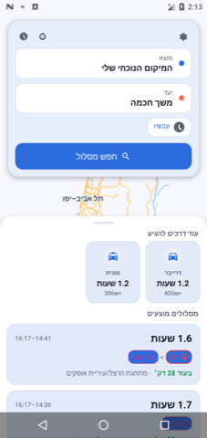
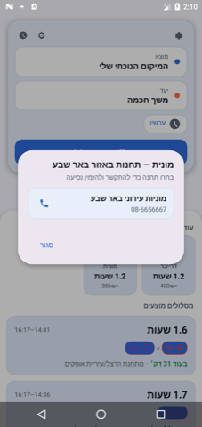

<div align="center">


# MovitTop

**אפליקציית תחבורה ציבורית וניווט הליכה — אופליין לגמרי, בלי אינטרנט, בלי Google Maps.**

מנוע הניתוב **MOTIS** רץ מקומית על המכשיר · מפות וקטוריות **Mapsforge** · תמיכה מלאה בעברית ו-RTL

</div>

---

## על האפליקציה

MovitTop היא אפליקציית Android למציאת מסלולים בתחבורה ציבורית, הליכה, אופניים, מונית ו"דרייבר" (הסעה פרטית) — **כולה עובדת אופליין**, בלי חיבור לאינטרנט בזמן שימוש. במקום לפנות לשרת חיצוני, האפליקציה מריצה על המכשיר עצמו בינארי C++ של מנוע הניתוב [MOTIS](https://github.com/motis-project/motis) כ-Foreground Service, שחושף שרת REST מקומי (`localhost`) שהאפליקציה מדברת איתו.

הפרויקט תוכנן במיוחד למכשירים חלשים/ישנים (מסכים קטנים, זיכרון מוגבל), עם דגש על יעילות זיכרון, יציבות של שירות הרקע, וממשק שמתפקד גם עם ניווט מקלדת/D-Pad.

### למה אופליין?
- **בלי תלות ברשת סלולרית** — שימושי באזורים עם קליטה חלשה או ללא מנוי דאטה.
- **נתוני התחבורה מתעדכנים בנפרד** — קובץ "חבילת נתונים" (גרף MOTIS מקומפל + מסד זמני קווים) מוכן מראש ומיובא למכשיר ידנית (USB / כרטיס זיכרון), ולא מורד "בשקט" ברקע.
- **מפות אופליין** בפורמט Mapsforge (`.map`) — בלי Google Maps ובלי חיוב API.

---

## תמונות מסך

<table>
<tr>
<td align="center" width="33%">
<br/>
<b>מסך הבית</b><br/>מפה אופליין + טופס חיפוש מוצא/יעד
</td>
<td align="center" width="33%">
<br/>
<b>בחירת מקום</b><br/>מיקום נוכחי, "בית"/"עבודה", מקומות אחרונים
</td>
<td align="center" width="33%">
<br/>
<b>תוצאות מסלול</b><br/>תחבורה ציבורית, מונית ודרייבר יחד — עם מחיר משוער וזמן הגעה
</td>
</tr>
<tr>
<td align="center" width="33%">
<br/>
<b>הזמנת מונית/דרייבר</b><br/>רשימת תחנות מוניות/הסעות קרובות עם חיוג ישיר
</td>
<td align="center" width="33%">
<br/>
<b>זמני קווים</b><br/>חיפוש קו, שמירת קווים מועדפים, לוחות זמנים אופליין
</td>
<td align="center" width="33%">
<br/>
<b>הגדרות</b><br/>מעבר מלא בין עברית (RTL) לאנגלית
</td>
</tr>
</table>

*כל הצילומים לקוחים מהאפליקציה בפועל, רצה על אמולטור Android.*

---

## תכונות עיקריות

- 🗺️ **ניתוב מולטימודלי** — תחבורה ציבורית (אוטובוסים לפי GTFS), הליכה, אופניים, מונית ודרייבר, כולם באותו מסך תוצאות עם השוואת זמן ומחיר.
- 📶 **אופליין לגמרי** — מפה, גיאוקודינג, וחישוב מסלולים כולם קורים מקומית על המכשיר דרך MOTIS; אין קריאות רשת לשרת חיצוני.
- 🚏 **זמני קווים** — חיפוש קו אוטובוס, צפייה בלוח הזמנים לפי כיוון, כניסה לנסיעה בודדת לכל התחנות שלה, ושמירת קווים מועדפים ("כוכב").
- 📍 **תחנות קרובות** ("Nearby") — יציאות קרובות קרובות למיקום הנוכחי, ממויינות לפי זמן.
- 🧭 **ניווט חי (Live Navigation)** — הנחיות שלב-אחר-שלב להליכה/רכיבה/נסיעה, עם מעקב GPS כשזמין ונפילה חכמה ללוח הזמנים כשאין GPS.
- 🚕 **הזמנת מונית/דרייבר** — רשימת תחנות מוניות והסעות פרטיות לפי אזור, עם חיוג ישיר מתוך האפליקציה ותמחור משוער (מרחק/זמן לפי MOTIS + נוסחת תמחור מקומית).
- 🔋 **RavKav** — מיקום תחנות טעינה/הטענה של כרטיס רב-קו הקרובות אליך.
- 🌗 **Light/Dark מלא**, עיצוב "פרימיום" בסגנון Waze עם צבעים מלאים.
- 🌍 **עברית/אנגלית + RTL מלא**, כולל החלפת שפה חיה מתוך האפליקציה.
- 🎮 **תמיכה ב-D-Pad/מקלדת פיזית** — כל האלמנטים התפעוליים נגישים בניווט מקלדת, מותאם למסכים קטנים (2.5") עם Progressive Disclosure (`BottomSheetBehavior`).
- 📦 **ייבוא נתונים ידני** — עדכון גרף הניתוב ולוחות הזמנים דרך קובץ חבילה יחיד, בלי אינטרנט במכשיר עצמו.

---

## ארכיטקטורה

```
┌─────────────────────────────────────────────────────────┐
│                     אפליקציית Android (Kotlin)             │
│                                                           │
│  UI (Activities/ViewModels)  ←→  Repositories  ←→  Room/  │
│  צ'אט חיפוש · תוצאות · ניווט חי      SQLite (זמני קווים,   │
│  זמני קווים · קרובים · הגדרות         RavKav, תמחור, favs) │
│                        │                                  │
│                        │ Retrofit/OkHttp (HTTP מקומי)      │
│                        ▼                                  │
│        MotisForegroundService  (Foreground Service)      │
│                        │                                  │
│                        ▼                                  │
│         libmotis.so  — MOTIS routing engine (C++)        │
│         שרת REST על localhost, גרף ניתוב + geocoding      │
│                                                           │
│         Mapsforge — רינדור מפה וקטורית אופליין (.map)      │
└─────────────────────────────────────────────────────────┘
```

- **מנוע ניתוב:** [MOTIS](https://github.com/motis-project/motis) — קומפול כספריית `.so` נייטיבית ל-ARM64 (`app/src/main/jniLibs/`), מורץ ע"י `MotisForegroundService`/`MotisBinaryManager` ומדובב דרך `MotisApi` (Retrofit) אל `RealMotisRepository`.
- **מפות:** Mapsforge — קבצי `.map` אופליין, בלי Google Play Services.
- **אחסון מקומי:** Room/SQLite לנתונים סטטיים — תחנות טעינת רב-קו, לוחות זמנים לפי קו, תמחור דרייבר קבוע, מקומות מועדפים/אחרונים.
- **שכבת UI:** Activities + ViewModels קלאסיים (ללא Compose), `RecyclerView` עם אדפטרים ייעודיים לכל מסך, ותמיכת נגישות/D-Pad מלאה.

תרשים המודולים העיקריים תחת [`app/src/main/java/iam699030/gmail/movitop`](app/src/main/java/iam699030/gmail/movitop):

| חבילה | תפקיד |
|---|---|
| `MainActivity` / `MainViewModel` | מסך הבית: מפה + טופס חיפוש מסלול |
| `search/` | בחירת מקום (מוצא/יעד), גיאוקודינג |
| `data/` | Repositories, מודלי נתונים, אדפטרים (מסלולים, תמחור, RavKav...) |
| `data/api/` | ה-DTOs וה-Retrofit client מול שרת MOTIS המקומי |
| `nav/` | מנוע הניווט החי (GPS/לוח-זמנים), חישובי מרחק/כיוון |
| `nearby/` | מסך "תחנות קרובות" |
| `map/` | רינדור המפה (Mapsforge) ותמה כהה/בהירה |
| `LineTimesActivity` / `LineTimesViewModel` | מסך זמני קווים |
| `LiveNavigationActivity` | ניווט חי שלב-אחר-שלב |
| `DataImportActivity` | ייבוא חבילת נתונים חדשה (גרף + לוחות זמנים) |
| `SettingsActivity` | שפה (עברית/English) |
| `MotisForegroundService` / `MotisBinaryManager` | הרצת מנוע MOTIS כשירות רקע |

---

## צנרת נתוני התחבורה (Offline data pipeline)

הגרף שמנוע MOTIS קורא, ולוח הזמנים המקומי, לא מגיעים מהאינטרנט בזמן ריצה — הם **מקומפלים מראש על מחשב פיתוח (macOS)** ומיובאים למכשיר כקובץ יחיד:

```
GTFS ארצי חדש ──► optimize_gtfs.py ──► compile_motis_graph.sh ──► build_line_schedules.py ──► package_motis_data.sh ──► יבוא באפליקציה
                  (מקטין shapes.txt)      (motis import →              (SQLite ללוחות          (חבילת zip אחת)
                                           גרף מקומפל)                   זמנים לפי קו)
```

| סקריפט | תפקיד |
|---|---|
| [`setup_movitop_data.sh`](setup_movitop_data.sh) | בוטסטראפ חד-פעמי: משכפל את MOTIS, מוריד GTFS ארצי + OSM של ישראל |
| [`optimize_gtfs.py`](optimize_gtfs.py) | מנקה את `shapes.txt` מנסיעות עירוניות (MOTIS משחזר גיאומטריה מ-OSM), שומר על נסיעות בין-עירוניות |
| [`compile_motis_graph.sh`](compile_motis_graph.sh) | מריץ `motis import` שמייצר את גרף הניתוב הסופי מתוך GTFS+OSM |
| [`build_line_schedules.py`](build_line_schedules.py) | בונה מסד SQLite קטן ללוחות זמנים לפי קו (למסך "זמני קווים") |
| [`package_motis_data.sh`](package_motis_data.sh) | אורז את הגרף + לוחות הזמנים לקובץ zip אחד, מוכן ליבוא |
| [`push_data_to_device.sh`](push_data_to_device.sh) | נוחות לפיתוח — דוחף את הנתונים ישירות למכשיר/אמולטור מחובר דרך adb |
| [`fetch_ravkav_charging_stations.py`](fetch_ravkav_charging_stations.py) | מרענן את רשימת תחנות טעינת רב-קו מתוך ה-GTFS הפתוח של משרד התחבורה |
| [`build_motis_arm64.sh`](build_motis_arm64.sh) | קרוס-קומפילציה של בינארי MOTIS ל-ARM64 (`libmotis.so`) עבור המכשיר |

### עדכון אוטומטי שבועי

שרשרת העיבוד המלאה רצה **אוטומטית כל מוצאי שבת ב-19:00 (שעון ישראל)** ב-GitHub Actions ([`.github/workflows/weekly-transit-data.yml`](.github/workflows/weekly-transit-data.yml)), ומפרסמת:
1. חבילת נתונים מעודכנת ל-GitHub Release קבוע בשם `transit-data-latest`.
2. עמוד הורדה קטן ל-GitHub Pages ([`github-pages/index.template.html`](github-pages/index.template.html)).

לפרטים מלאים (מגבלות runner, הרצה ידנית, איפה זה מתפרסם) ראו [`GITHUB_AUTOMATION.md`](GITHUB_AUTOMATION.md).

---

## התקנה מקומית / פיתוח

### דרישות
- Android Studio עדכני, JDK 11, Android SDK (`compileSdk 36`, `minSdk 24`).
- לבניית מנוע ה-MOTIS מחדש: macOS + Docker (ראו [`build_motis_arm64.sh`](build_motis_arm64.sh)) — לא נדרש אם רק עובדים על צד ה-Kotlin, כי `libmotis.so` כבר נמצא בריפו.

### שיבוט והרצה
```bash
git clone https://github.com/a-true-man/MovitTop.git
cd MovitTop
./gradlew assembleDebug
```

### קבלת נתוני תחבורה לפיתוח/בדיקה
האפליקציה לא עובדת כמו שצריך בלי נתוני תחבורה מיובאים. שתי אפשרויות:
1. **הכי מהיר:** להוריד את חבילת ה-`movitop-data-latest.zip` העדכנית מדף ה-GitHub Pages של הפרויקט, ולייבא אותה דרך מסך "ייבוא נתוני תחבורה מעודכנים" באפליקציה.
2. **בנייה מקומית מלאה:** להריץ את שרשרת הסקריפטים למעלה (`setup_movitop_data.sh` → ... → `package_motis_data.sh`), ואז לדחוף לאמולטור/מכשיר מחובר עם `push_data_to_device.sh`.

---

## טכנולוגיות

Kotlin · Android SDK · [MOTIS](https://github.com/motis-project/motis) (C++, NDK) · [Mapsforge](https://github.com/mapsforge/mapsforge) · Room/SQLite · Retrofit/OkHttp · GitHub Actions

---

## קרדיטים

- מנוע הניתוב: [MOTIS Project](https://github.com/motis-project/motis)
- מפות אופליין: [Mapsforge](https://github.com/mapsforge/mapsforge)
- נתוני תחבורה ציבורית: GTFS הארצי של משרד התחבורה הישראלי
